# Awesome-Speculative-Decoding

Reading list on speculative decoding.

**Table of Contents**

- [Bibliography by Venues](#bibliography-by-venues)
  - [EMNLP 2025](#emnlp-2025)
  - [ACL 2025](#acl-2025)
  - [ICML 2025](#icml-2025)
  - [ICLR 2025](#iclr-2025)
  - [NAACL 2025](#naacl-2025)
  - [NeurIPS 2024](#neurips-2024)
  - [EMNLP 2024](#emnlp-2024)
  - [ACL 2024](#acl-2024)
  - [ICML 2024](#icml-2024)
  - [ICLR 2024](#iclr-2024)
  - [NAACL 2024](#naacl-2024)
- [History & Origin](#history--origin)
- [Draft Models](#draft-models)
  - [Lookahead Padding](#lookahead-padding)
  - [Layer Skipping & Early Exiting](#layer-skipping--early-exiting)
  - [Draft Model Based on Target Hidden States](#draft-model-based-on-target-hidden-states)
  - [Others](#others)
- [Retrieval-based Speculative Decoding](#retrieval-based-speculative-decoding)
- [Draft Tree Construction](#draft-tree-construction)
- [Verification Strategies](#verification-strategies)
- [Draft Length Control](#draft-length-control)
- [Speculative Decoding + Other Technologies](#speculative-decoding--other-technologies)
- [Citation](#citation)
- [Other Awesome Lists](#other-awesome-lists)

## Bibliography by Venues

### EMNLP 2025

**Main**

- "QSpec: Speculative Decoding with Complementary Quantization Schemes" [2024-10] [[paper](https://arxiv.org/abs/2410.11305)]

- "Draft Model Knows When to Stop: Self-Verification Speculative Decoding for Long-Form Generation" [2024-11] [[paper](https://arxiv.org/abs/2411.18462)]

- "Dovetail: A CPU/GPU Heterogeneous Speculative Decoding for LLM inference" [2024-12] [[paper](https://arxiv.org/abs/2412.18934)]

- "Alignment-Augmented Speculative Decoding with Alignment Sampling and Conditional Verification" [2025-05] [[paper](https://arxiv.org/abs/2505.13204)]

- "Accelerated Test-Time Scaling with Model-Free Speculative Sampling" [2025-06] [[paper](https://arxiv.org/abs/2506.04708)]

- "Spec-VLA: Speculative Decoding for Vision-Language-Action Models with Relaxed Acceptance" [2025-07] [[paper](https://arxiv.org/abs/2507.22424)]

- "Reward-Shifted Speculative Sampling Is An Efficient Test-Time Weak-to-Strong Aligner" [2025-08] [[paper](https://arxiv.org/abs/2508.15044)]

- "SpecVLM: Enhancing Speculative Decoding of Video LLMs via Verifier-Guided Token Pruning" [2025-08] [[paper](https://arxiv.org/abs/2508.16201)]

- "Speculative Safety-Aware Decoding" [2025-08] [[paper](https://arxiv.org/abs/2508.17739)]

- "Faster In-Context Learning for LLMs via N-Gram Trie Speculative Decoding" [2025-11] [[paper](https://aclanthology.org/2025.emnlp-main.911/)]

- "Speculative Streaming: Efficient and Scalable Speculative Decoding with Multi-Stream Attention" [2025-11] [[paper](https://aclanthology.org/2025.emnlp-main.986/)]

- "Cacheback: Speculative Decoding With Nothing But Cache" [2025-11] [[paper](https://www.arxiv.org/abs/2511.21699)]

**Findings**

- "Speculative Decoding for Multi-Sample Inference" [2025-03] [[paper](https://arxiv.org/abs/2503.05330)]

- "MASSV: Multimodal Adaptation and Self-Data Distillation for Speculative Decoding of Vision-Language Models" [2025-05] [[paper](https://arxiv.org/abs/2505.10526)]

- "Mamba Drafters for Speculative Decoding" [2025-06] [[paper](https://arxiv.org/abs/2506.01206)]

- "FractalLLM: Lossless Self-Speculative Decoding with Layer Embedded Self-Compression" [2025-11] [[paper](https://aclanthology.org/2025.findings-emnlp.1286/)]

- "SpecCoT: Accelerating Chain-of-Thought Reasoning through Speculative Exploration" [2025-11] [[paper](https://aclanthology.org/2025.findings-emnlp.1326/)]

### ACL 2025

**Main**

- "Turning Trash into Treasure: Accelerating Inference of Large Language Models with Token Recycling" [2024-08] [[paper](https://arxiv.org/abs/2408.08696)]

- "SAM Decoding: Speculative Decoding via Suffix Automaton" [2024-11] [[paper](https://arxiv.org/abs/2411.10666)]

- "FR-Spec: Accelerating Large-Vocabulary Language Models via Frequency-Ranked Speculative Sampling" [2025-02] [[paper](https://arxiv.org/abs/2502.14856)]

- "TETRIS: Optimal Draft Token Selection for Batch Speculative Decoding" [2025-02] [[paper](https://arxiv.org/abs/2502.15197)]

- "CORAL: Learning Consistent Representations across Multi-step Training with Lighter Speculative Drafter" [2025-02] [[paper](https://arxiv.org/abs/2502.16880)]

- "CLaSp: In-Context Layer Skip for Self-Speculative Decoding" [2025-05] [[paper](https://arxiv.org/abs/2505.24196)]

- "A Drop-In Solution for On-the-Fly Adaptation of Speculative Decoding in Large Language Models" [2025-07] [[paper](https://aclanthology.org/2025.acl-long.482/)]

- "Faster Speculative Decoding via Effective Draft Decoder with Pruned Candidate Tree" [2025-07] [[paper](https://aclanthology.org/2025.acl-long.486/)]

- "SPECTRA: Faster Large Language Model Inference with Optimized Internal and External Speculation" [2025-07] [[paper](https://aclanthology.org/2025.acl-long.685/)]

**Findings**

- "DReSD: Dense Retrieval for Speculative Decoding" [2025-02] [[paper](https://arxiv.org/abs/2502.15572)]

- "Fuzzy Speculative Decoding for a Tunable Accuracy-Runtime Tradeoff" [2025-02] [[paper](https://arxiv.org/abs/2502.20704)]

- "RASD: Retrieval-Augmented Speculative Decoding" [2025-03] [[paper](https://arxiv.org/abs/2503.03434)]

- "Speculative Sampling via Exponential Races" [2025-04] [[paper](https://arxiv.org/abs/2504.15475)]

### ICML 2025

- "Accelerated Diffusion Models via Speculative Sampling" [2025-01] [[paper](https://arxiv.org/abs/2501.05370)]

- "Reward-Guided Speculative Decoding for Efficient LLM Reasoning" [2025-01] [[paper](https://arxiv.org/abs/2501.19324)]

- "Fast Large Language Model Collaborative Decoding via Speculation" [2025-02] [[paper](https://arxiv.org/abs/2502.01662)]

- "Speculative Prefill: Turbocharging TTFT with Lightweight and Training-Free Token Importance Estimation" [2025-02] [[paper](https://arxiv.org/abs/2502.02789)]

- "Accelerating LLM Inference with Lossless Speculative Decoding Algorithms for Heterogeneous Vocabularies" [2025-02] [[paper](https://arxiv.org/abs/2502.05202)]

- "QuantSpec: Self-Speculative Decoding with Hierarchical Quantized KV Cache" [2025-02] [[paper](https://arxiv.org/abs/2502.10424)]

- "RAPID: Long-Context Inference with Retrieval-Augmented Speculative Decoding" [2025-02] [[paper](https://arxiv.org/abs/2502.20330)]

- "Gumiho: A Hybrid Architecture to Prioritize Early Tokens in Speculative Decoding" [2025-03] [[paper](https://arxiv.org/abs/2503.10135)]

- "SpeCache: Speculative Key-Value Caching for Efficient Generation of LLMs" [2025-03] [[paper](https://arxiv.org/abs/2503.16163)]

- "Accelerating Large Language Model Reasoning via Speculative Search" [2025-05] [[paper](https://arxiv.org/abs/2505.02865)]

- "Diffusion Models are Secretly Exchangeable: Parallelizing DDPMs via Auto Speculation" [2025-05] [[paper](https://arxiv.org/abs/2505.03983)]

- "BanditSpec: Adaptive Speculative Decoding via Bandit Algorithms" [2025-05] [[paper](https://arxiv.org/abs/2505.15141)]

- "Attention-Level Speculation" [2025-07] [[paper](https://proceedings.mlr.press/v267/cai25g.html)]

- "polybasic Speculative Decoding Through a Theoretical Perspective" [2025-07] [[paper](https://arxiv.org/abs/2510.26527)]

### ICLR 2025

- "Block Verification Accelerates Speculative Decoding" [2024-03] [[paper](https://arxiv.org/abs/2403.10444)]

- "Distributed Speculative Inference (DSI): Speculation Parallelism for Provably Faster Lossless Language Model Inference" [2024-05] [[paper](https://arxiv.org/abs/2405.14105)]

- "Faster Cascades via Speculative Decoding" [2024-05] [[paper](https://arxiv.org/abs/2405.19261)]

- "Speculative RAG: Enhancing Retrieval Augmented Generation through Drafting" [2024-07] [[paper](https://arxiv.org/abs/2407.08223)]

- "MagicDec: Breaking the Latency-Throughput Tradeoff for Long Context Generation with Speculative Decoding" [2024-08] [[paper](https://arxiv.org/abs/2408.11049)]

- "PEARL: Parallel Speculative Decoding with Adaptive Draft Length" [2024-08] [[paper](https://arxiv.org/abs/2408.11850)]

- "Learning Harmonized Representations for Speculative Sampling" [2024-08] [[paper](https://arxiv.org/abs/2408.15766)]

- "Accelerating Auto-regressive Text-to-Image Generation with Training-free Speculative Jacobi Decoding" [2024-10] [[paper](https://arxiv.org/abs/2410.01699)]

- "LANTERN: Accelerating Visual Autoregressive Models with Relaxed Speculative Decoding" [2024-10] [[paper](https://arxiv.org/abs/2410.03355)]

- "Mixture of Attentions For Speculative Decoding" [2024-10] [[paper](https://arxiv.org/abs/2410.03804)]

- "SWIFT: On-the-Fly Self-Speculative Decoding for LLM Inference Acceleration" [2024-10] [[paper](https://arxiv.org/abs/2410.06916)]

- "Multi-Draft Speculative Sampling: Canonical Decomposition and Theoretical Limits" [2024-10] [[paper](https://arxiv.org/abs/2410.18234)]

- "Judge Decoding: Faster Speculative Sampling Requires Going Beyond Model Alignment" [2025-01] [[paper](https://arxiv.org/abs/2501.19309)]

- "Towards Optimal Multi-draft Speculative Decoding" [2025-02] [[paper](https://arxiv.org/abs/2502.18779)]

### NAACL 2025

**Main**

- "Decoding Speculative Decoding" [2024-02] [[paper](https://arxiv.org/abs/2402.01528)]

- "EMS-SD: Efficient Multi-sample Speculative Decoding for Accelerating Large Language Models" [2024-05] [[paper](https://arxiv.org/abs/2405.07542)]

- "Speculative Diffusion Decoding: Accelerating Language Generation through Diffusion" [2024-08] [[paper](https://arxiv.org/abs/2408.05636)]

- "Constrained Decoding with Speculative Lookaheads" [2024-12] [[paper](https://arxiv.org/abs/2412.10418)]

**Findings**

- "Lossless Acceleration of Large Language Models with Hierarchical Drafting based on Temporal Locality in Speculative Decoding" [2025-02] [[paper](https://arxiv.org/abs/2502.05609)]

- "Hierarchical Speculative Decoding with Dynamic Window" [2025-04] [[paper](https://aclanthology.org/2025.findings-naacl.462/)]

### NeurIPS 2024

- "Cascade Speculative Drafting for Even Faster LLM Inference" [2023-12] [[paper](https://arxiv.org/abs/2312.11462)]

- "Sequoia: Scalable and Robust Speculative Decoding" [2024-02] [[paper](https://arxiv.org/abs/2402.12374)]

- "Kangaroo: Lossless Self-Speculative Decoding for Accelerating LLMs via Double Early Exiting" [2024-04] [[paper](https://arxiv.org/abs/2404.18911)]

- "Nearest Neighbor Speculative Decoding for LLM Generation and Attribution" [2024-05] [[paper](https://arxiv.org/abs/2405.19325)]

- "SpecExec: Massively Parallel Speculative Decoding For Interactive LLM Inference on Consumer Devices" [2024-06] [[paper](https://arxiv.org/abs/2406.02532)]

- "A Theoretical Perspective for Speculative Decoding Algorithm" [2024-10] [[paper](https://arxiv.org/abs/2411.00841)]

- "Inevitable Trade-off between Watermark Strength and Speculative Sampling Efficiency for Language Models" [2024-10] [[paper](https://arxiv.org/abs/2410.20418)]

- "Speculative Decoding with CTC-based Draft Model for LLM Inference Acceleration" [2024-12] [[paper](https://arxiv.org/abs/2412.00061)]

### EMNLP 2024

**Main**

- "Ouroboros: Generating Longer Drafts Phrase by Phrase for Faster Speculative Decoding" [2024-02] [[paper](https://arxiv.org/abs/2402.13720)]

- "Optimized Speculative Sampling for GPU Hardware Accelerators" [2024-06] [[paper](https://arxiv.org/abs/2406.11016)]

- "Towards Fast Multilingual LLM Inference: Speculative Decoding and Specialized Drafters" [2024-06] [[paper](https://arxiv.org/abs/2406.16758)]

- "EAGLE-2: Faster Inference of Language Models with Dynamic Draft Trees" [2024-06] [[paper](https://arxiv.org/abs/2406.16858)]

- "SpecHub: Provable Acceleration to Multi-Draft Speculative Decoding" [2024-11] [[paper](https://arxiv.org/abs/2411.05289)]

**Findings**

- "Draft on the Fly: Adaptive Self-Speculative Decoding using Cosine Similarity" [2024-10] [[paper](https://arxiv.org/abs/2410.01028)]

- "Temperature-Centric Investigation of Speculative Decoding with Knowledge Distillation" [2024-10] [[paper](https://arxiv.org/abs/2410.10141)]

### ACL 2024

**Main**

- "Draft & Verify: Lossless Large Language Model Acceleration via Self-Speculative Decoding" [2023-09] [[paper](https://arxiv.org/abs/2309.08168)]

- "Speculative Contrastive Decoding" [2023-11] [[paper](https://arxiv.org/abs/2311.08981)]

- "LayerSkip: Enabling Early Exit Inference and Self-Speculative Decoding" [2024-04] [[paper](https://arxiv.org/abs/2404.16710)]

**Findings**

- "Unlocking Efficiency in Large Language Model Inference: A Comprehensive Survey of Speculative Decoding" [2024-01] [[paper](https://arxiv.org/abs/2401.07851)]

- "BASS: Batched Attention-optimized Speculative Sampling" [2024-04] [[paper](https://arxiv.org/abs/2404.15778)]

- "Speculative Decoding via Early-exiting for Faster LLM Inference with Thompson Sampling Control Mechanism" [2024-06] [[paper](https://arxiv.org/abs/2406.03853)]

- "Graph-Structured Speculative Decoding" [2024-07] [[paper](https://arxiv.org/abs/2407.16207)]

### ICML 2024

- "Online Speculative Decoding" [2023-10] [[paper](https://arxiv.org/abs/2310.07177)]

- "Medusa: Simple LLM Inference Acceleration Framework with Multiple Decoding Heads" [2024-01] [[paper](https://arxiv.org/abs/2401.10774)]

- "EAGLE: Speculative Sampling Requires Rethinking Feature Uncertainty" [2024-01] [[paper](https://arxiv.org/abs/2401.15077)]

- "Break the Sequential Dependency of LLM Inference Using Lookahead Decoding" [2024-02] [[paper](https://arxiv.org/abs/2402.02057)]

- "GliDe with a CaPE: A Low-Hassle Method to Accelerate Speculative Decoding" [2024-02] [[paper](https://arxiv.org/abs/2402.02082)]

- "Accelerated Speculative Sampling Based on Tree Monte Carlo" [2024-07] [[paper](https://proceedings.mlr.press/v235/hu24f.html)]

### ICLR 2024

- "DistillSpec: Improving Speculative Decoding via Knowledge Distillation" [2023-10] [[paper](https://arxiv.org/abs/2310.08461)]

### NAACL 2024

**Main**

- "REST: Retrieval-Based Speculative Decoding" [2023-11] [[paper](https://arxiv.org/abs/2311.08252)]

**Findings**

- "SLiM: Speculative Decoding with Hypothesis Reduction" [2024-06] [[paper](https://aclanthology.org/2024.findings-naacl.63/)]

## History & Origin

- "Fast Inference from Transformers via Speculative Decoding" [2022-11] [ICML 2023] [[paper](https://arxiv.org/abs/2211.17192)]

  > Experiments on: T5-11B, LaMDA-137B | WMT En-De, CNN/DM

- "Accelerating Large Language Model Decoding with Speculative Sampling" [2023-02] [[paper](https://arxiv.org/abs/2302.01318)]

  > Experiemnts on: Chinchilla-70B | XSum, HumanEval

## Draft Models

### Lookahead Padding

- "Accelerating Transformer Inference for Translation via Parallel Decoding" [2023-05] [ACL 2023] [[paper](https://arxiv.org/abs/2305.10427)]

  > A block of [PAD] tokens are iteratively refined until no token changes in the block. Applies off-the-shelf to any autoregressive model.
  >
  > Experiments on: machine translation

    <p align="center">
    </img>
    </p>

- "PaSS: Parallel Speculative Sampling" [2023-11] [[paper](https://arxiv.org/abs/2311.13581)]

  > Learn special tokens ($L$ lookahead embeddings $[LA]_1, \cdots, [LA]_L$) on a small training set
  >
  > Experiments on: LLaMA-7B | Wikipedia, Stack

### Layer Skipping & Early Exiting

- "Draft & Verify: Lossless Large Language Model Acceleration via Self-Speculative Decoding" [2023-09] [ACL 2024] [[paper](https://arxiv.org/abs/2309.08168)]

  > The target LLM selectively skips some of its intermediate layers to generate draft tokens
  >
  > Experiments on: LLaMA-2-13B/70B, LLaMA-2-13B-Chat, CodeLLaMA-13B | CNN/DM, XSum, HumanEval

- "Speculative Decoding via Early-exiting for Faster LLM Inference with Thompson Sampling Control Mechanism" [2024-06] [ACL 2024 Findings] [[paper](https://arxiv.org/abs/2406.03853)]

  > Introduces a trainable early-exiting layer on top of the target model's N-th layer hidden states to generate draft tokens
  >
  > Experiments on: LLaMA-2-13B/70B, LLaMA-2-Chat-70B, Vicuna-13B, CodeLLaMA-13B | GSM8K, XSum, HumanEval, MT-Bench

    <p align="center">
    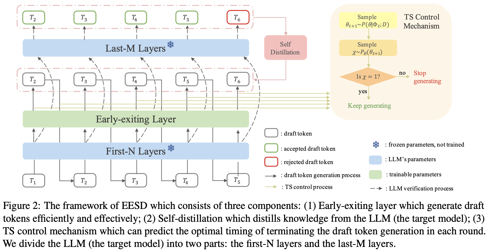</img>
    </p>

### Draft Model Based on Target Hidden States

- "Medusa: Simple LLM Inference Acceleration Framework with Multiple Decoding Heads" [2024-01] [ICML 2024] [[paper](https://arxiv.org/abs/2401.10774)]

  > Train one head (a two-layer FFN with residual connection) for each draft token position
  >
  > Experiemnts on: Vicuna-7B/13B/33B, Zephyr-7B | MT-Bench

    <p align="center">
    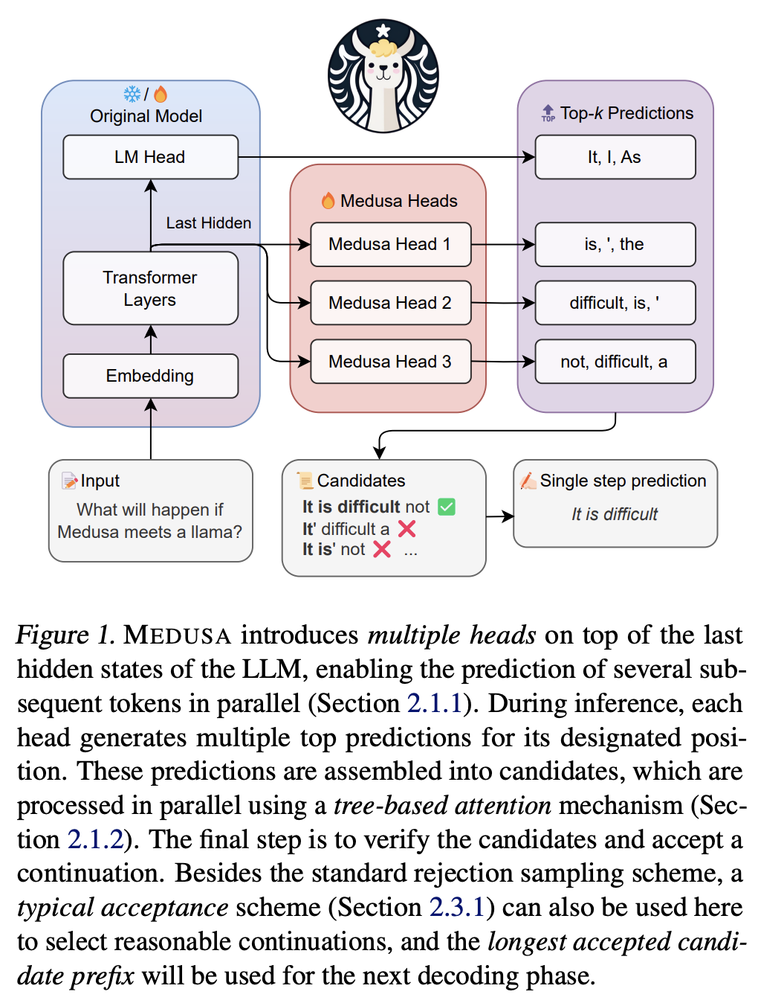</img>
    </p>

- "EAGLE: Speculative Sampling Requires Rethinking Feature Uncertainty" [2024-01] [ICML 2024] [[paper](https://arxiv.org/abs/2401.15077)]

  > The draft model autoregressively processes at the feature (hidden states before LM head) level and then derives tokens using the LM head of the target model
  >
  > Experiments on: Vicuna-7B/13B/33B, LLaMA2-Chat-7B/13B/70B, Mixtral-8x7B-Instruct | MT-Bench, HumanEval, GSM8K, Alpaca

    <p align="center">
    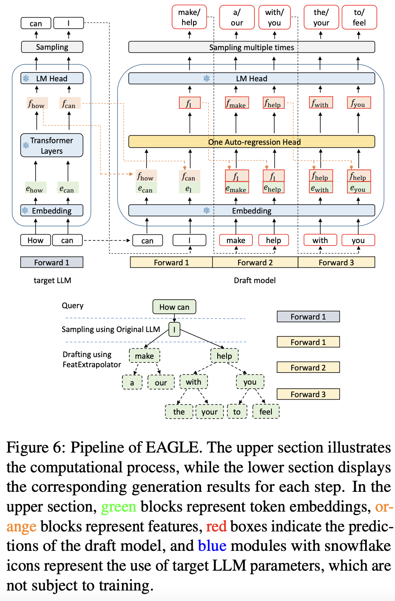</img>
    </p>

- "GliDe with a CaPE: A Low-Hassle Method to Accelerate Speculative Decoding" [2024-02] [ICML 2024] [[paper](https://arxiv.org/abs/2402.02082)]

  > Each layer in the draft model attends to a corresponding layer in the target, counting from the top
  >
  > Experiments on: Vicuna-7B/13B/33B, Mistral-7B-Instruct-v0.1 | GSM8K, Finance-Alpaca, Spider, CodeSearchNet-Python

    <p align="center">
    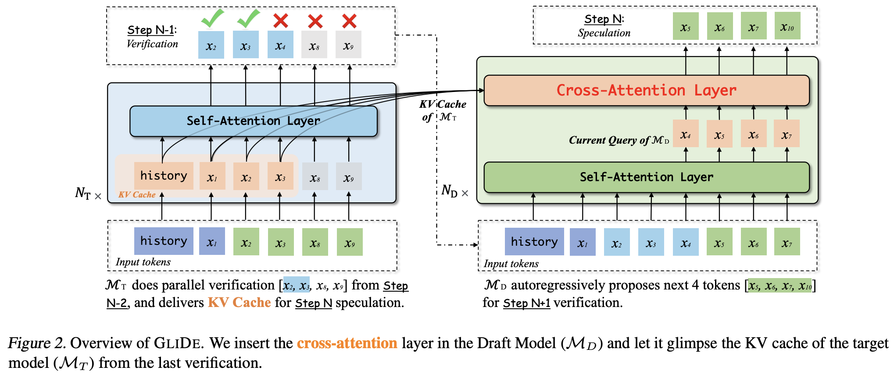</img>
    </p>

- "Hydra: Sequentially-Dependent Draft Heads for Medusa Decoding" [2024-02] [[paper](https://arxiv.org/abs/2402.05109)]

  > A variant of Medusa where each draft head takes output from the previous head as input
  >
  > Experiments on: Vicuna-7B/13B/33B | MT-Bench

    <p align="center">
    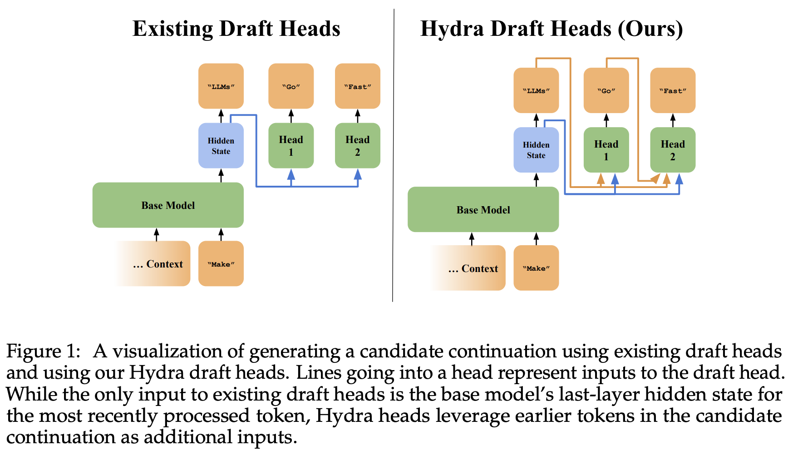</img>
    </p>

- "Gumiho: A Hybrid Architecture to Prioritize Early Tokens in Speculative Decoding" [2025-03] [[paper](https://arxiv.org/abs/2503.10135)]

  > EAGLE for the first two draft tokens, Medusa for the next 5.
  >
  > Experiments on: Vicuna7B/13B, LLaMA-2-Chat-7B/13B/70B, LLaMA-3-Instruct-8B/70B | MT-Bench, HumanEval, GSM8K, Alpaca, CNN/DM, Natural Questions.

    <p align="center">
    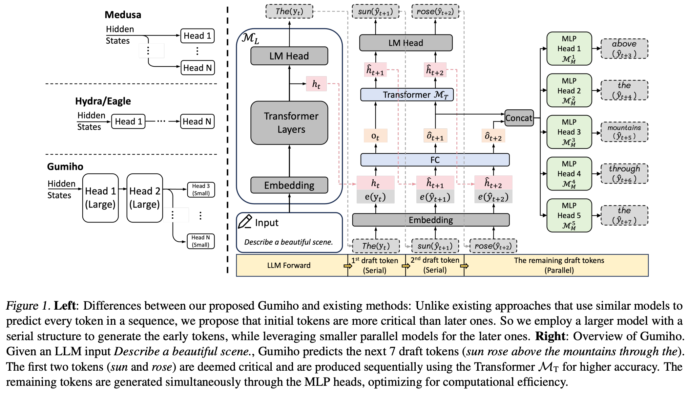</img>
    </p>

### Others

- "Online Speculative Decoding" [2023-11] [ICML 2024] [[paper](https://arxiv.org/abs/2310.07177)]

  > Continuously update the draft model on observed user query data
  >
  > Experiments on: Vicuna-7B, Flan-T5-3B | Spider, GSM8K, CodeSearchNet-Python, Alpaca-finance

- "Cascade Speculative Drafting for Even Faster LLM Inference" [2023-12] [NeurIPS 2024] [[paper](https://arxiv.org/abs/2312.11462)]

  > - Vertical cascade: in a series of draft models, each model reviews drafts from a smaller one, with the smallest model being a statistical model
  > - Horizontal cascade: assigns the largest draft model to generate the first draft token, and uses progressively smaller draft models to generate the following tokens (which are less likely to be accepted)
  >
  > Experiemnts on: Flan-T5, LLaMA-2-Chat-7B | GSM8K, MMLU

- "Training Domain Draft Models for Speculative Decoding: Best Practices and Insights" [2025-03] [[paper](https://arxiv.org/abs/2503.07807)]

  > domain-specific draft models (function calling, biology, Chinese)
  >
  > Experiments on: LLaMA-3.1-8B

- "ML-SpecQD: Multi-Level Speculative Decoding with Quantized Drafts" [2025-03] [[paper](https://arxiv.org/abs/2503.13565)]

  > 4-bit quantization in MXFP4 datatype as draft model
  >
  > Experiments on: LLaMA2 7B, Qwen2.5-Coder 7B | HAGRID, MBPP

    <p align="center">
    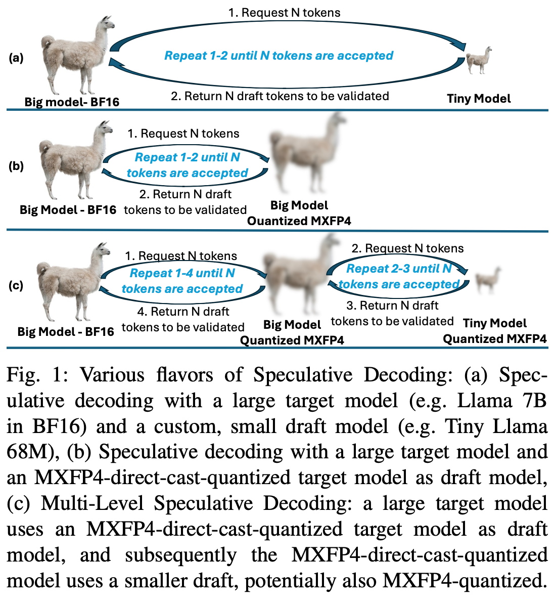</img>
    </p>

- "Automatic Task Detection and Heterogeneous LLM Speculative Decoding" [2025-05] [[paper](https://arxiv.org/abs/2505.08600)]

  > Automatically categorizes downstream tasks into different sub-tasks and assigns them to a set of heterogeneous (LoRA-trained) draft models
  >
  > Experiments on: LLaMA2 13B | Wanjuan 1.0, ChemData700K

- "Mamba Drafters for Speculative Decoding" [2025-06] [[paper](https://arxiv.org/abs/2506.01206)]

  > Experiments on: Pythia 6.9B, Mistral 7B | XSum, CNN/DM, GSM8K, MT-Bench, Alpaca, HumanEval, LongBench

## Retrieval-based Speculative Decoding

- "Ouroboros: Generating Longer Drafts Phrase by Phrase for Faster Speculative Decoding" [2024-02] [EMNLP 2024] [[paper](https://arxiv.org/abs/2402.13720)]

  > Extends the last draft token to phrases. Does not require additional training.
  >
  > Experiments on: Yi-Base-34B, DeepSeek-Coder-Instruct-33B, CodeLLaMA-Instruct-34B, LLaMA-2-Chat-70B | HumanEval, MBPP, GSM8K, CNN/DM, WMT16

    <p align="center">
    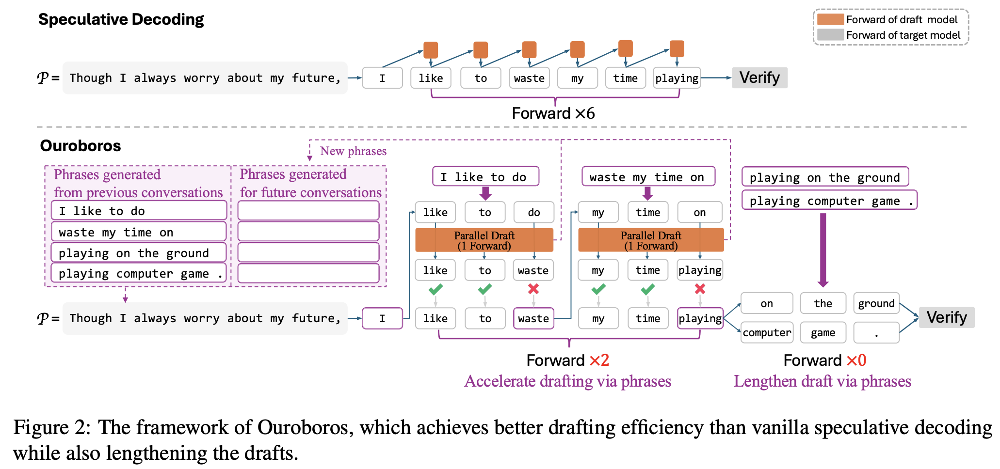</img>
    </p>

- "SuffixDecoding: A Model-Free Approach to Speeding Up Large Language Model Inference" [2024-11] [[paper](https://arxiv.org/abs/2411.04975)]

  > N-gram draft model that's built on-the-fly from a suffix tree
  >
  > Experiments on: LLaMA-3-70B-Instruct | WildChat, Magicoder, Spider, AgenticSQL

    <p align="center">
    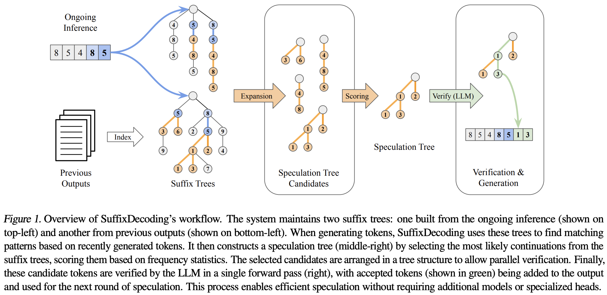</img>
    </p>

- "SAM Decoding: Speculative Decoding via Suffix Automaton" [2024-11] [[paper](https://arxiv.org/abs/2411.10666)]

  > Another n-gram draft model that's built on-the-fly from a suffix tree
  >
  > Experiments on: Vicuna-7B-v1.3 | MT-Bench, WMT14 De-En, CNN/DM, Natural Question, GSM8K, DPR

- "Speculative Decoding for Multi-Sample Inference" [2025-03] [[paper](https://arxiv.org/abs/2503.05330)]

  > SD method tailored for multi-sample reasoning scenarios, such as self-consistency and Best-of-N sampling.
  >
  > "for any partial sequence on the path $i$, we use its $k$-token suffix as a query to search for matching prefixes in other paths"
  >
  > Experiments on: Qwen2.5-7B-Instruct, LLaMA-3-8B-Instruct | GSM8K, MATH

## Draft Tree Construction

- "GliDe with a CaPE: A Low-Hassle Method to Accelerate Speculative Decoding" [2024-02] [ICML 2024] [[paper](https://arxiv.org/abs/2402.02082)]

  > Expand each draft token to top-$k$ candidates where $k$ is a piecewise linear function of the top-1 confidence score $p$, set to 7, 5, 3, 1 for $p$ in (0, 0.3], (0.3, 0.6], (0.6, 0.8], (0.8, 1] respectively.
  >
  > Experiments on: Vicuna-7B/13B/33B | MT-Bench

    <p align="center">
    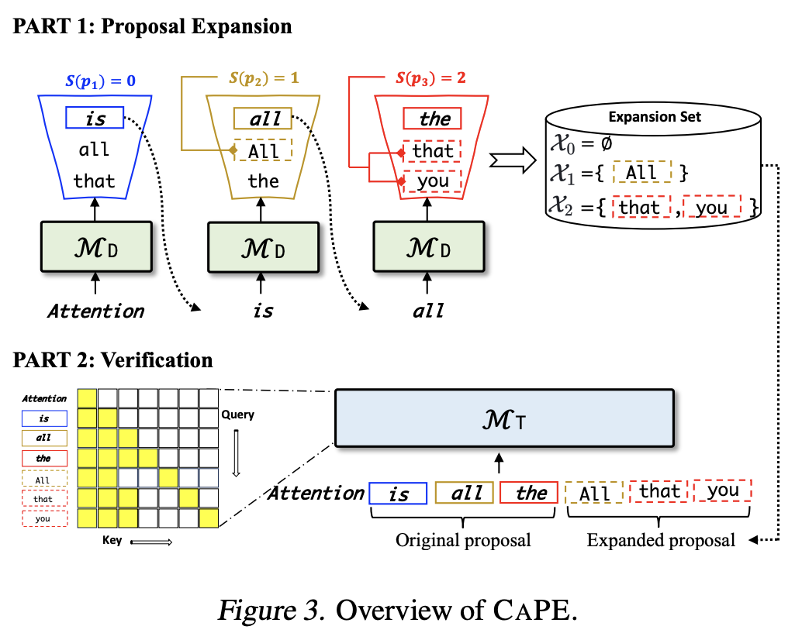</img>
    </p>

- "EAGLE-2: Faster Inference of Language Models with Dynamic Draft Trees" [2024-06] [EMNLP 2024] [[paper](https://arxiv.org/abs/2406.16858)]

  > In the draft tree, some shallow nodes that are not expanded may have higher values than the deeper expanded nodes. Thus, EAGLE-2 reranks all draft tokens and select the top $m$ tokens with the highest values.
  >
  > Experiments on: Vicuna-7B/13B, LLaMA2-Chat-7B/13B/70B, LLaMA3-Instruct-8B/70B | MT-Bench, HumanEval, GSM8K, CNN/DM, Natural Questions

    <p align="center">
    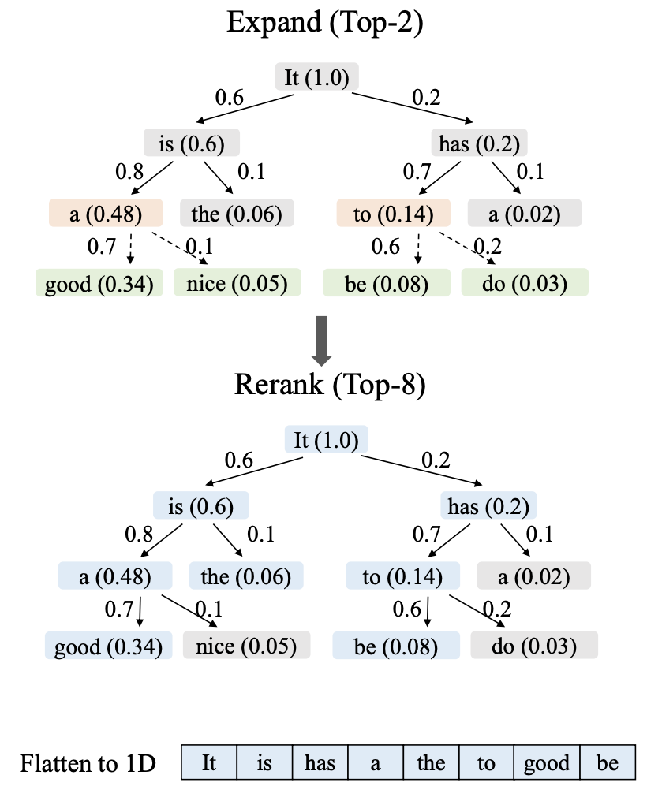</img>
    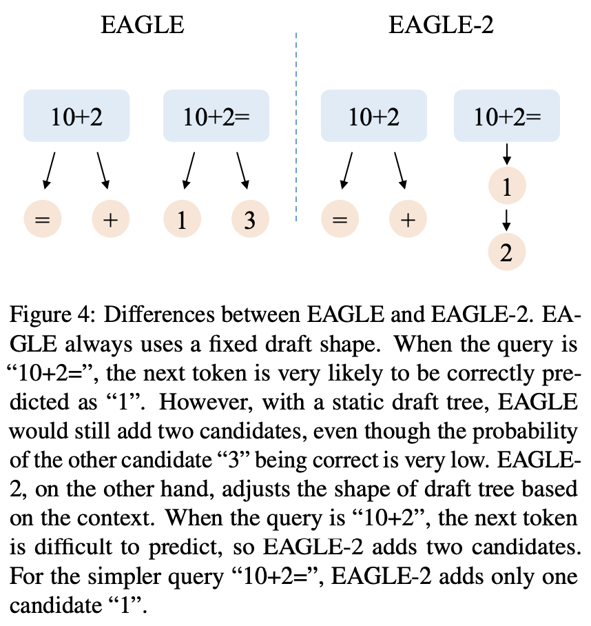</img>
    </p>

- "HeteroSpec: Leveraging Contextual Heterogeneity for Efficient Speculative Decoding" [2025-05] [[paper](https://arxiv.org/abs/2505.13254)]

  > HeteroSpec dynamically optimizes computational resource allocation based on linguistic context complexity
  >
  > - The depth of low-entropy draft paths is increased
  > - More branches are pruned in low-entropy draft paths to focus on high-likelihood branches.
  > - Just-in-time graph tracing and compilation are employed to optimize computation graphs.
  >
  > Experiments on: Vicuna 13B, LLaMA-3.1-Instruct 8B, LLaMA-3.3-Instruct 70B, R1 8B | MT-Bench, HumanEval, GSM8K, Alpaca, CNN/DM.

## Verification Strategies

- "SpecTr: Fast Speculative Decoding via Optimal Transport" [2023-10] [NeurIPS 2023] [[paper](https://arxiv.org/abs/2310.15141)]

  > Introduced OTM - Optimal Transport with Membership cost - and an approximation that's linear in vocabulary size and logarithmic in candidate set size to tackle draft selection when there are multiple drafts
  >
  > Experiments on: PALM-2-Bison | LM1B

- "TETRIS: Optimal Draft Token Selection for Batch Speculative Decoding" [2025-02] [[paper](https://arxiv.org/abs/2502.15197)]

  > Selects draft tokens for verification based on draft model's output probability
  >
  > Experiments on: Vicuna-33B-v1.3, LLaMA-3.1-70B/405B-Instruct | ShareGPT, Chatbot Arena, Domain Tough Questions

    <p align="center">
    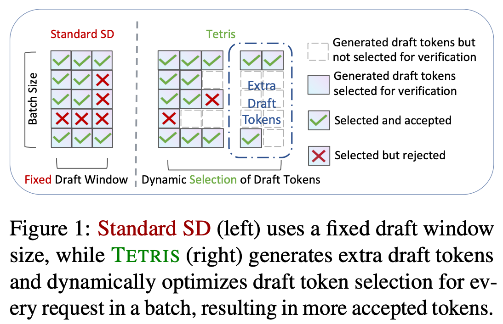</img>
    </p>

## Draft Length Control

- "Dynamic Speculation Lookahead Accelerates Speculative Decoding of Large Language Models" [2024-05] [[paper](https://arxiv.org/abs/2405.04304)]

  > After generating a draft token, an FFN decides whether or not to continue drafting (input of FFN: top-10 draft model confidence, draft model entropy, token position)
  >
  > Experiments on: Vicuna-13B-v1.3, Starcoder-15B | CNN/DM, Alpaca, HumanEval, MBPP

- "Dynamic Depth Decoding: Faster Speculative Decoding for LLMs" [2024-08] [[paper](https://arxiv.org/abs/2409.00142)]

  > In the EAGLE framework, use the sum of the probabilities of all the sequences in the beam as a heuristic for whether or not to continue draft generation
  >
  > Experiments on: Vicuna-7B/13B, LLaMA2-Chat-7B/13B | MT-Bench

- "Draft Model Knows When to Stop: A Self-Verification Length Policy for Speculative Decoding" [2024-11] [[paper](https://arxiv.org/abs/2411.18462)]

  > After generating a draft token, the model decides whether or not to continue draft based on draft model entropy.
  >
  > Applies off-the-shelf to any autoregressive speculative decoding system without training.
  >
  > Experiments on: Pythia-6.9B, Vicuna-7B/13B-v1.3, LLaMA-3-70B, Qwen2.5-14B/32B, QwQ | MT-Bench, HumanEval, GSM8K, Alpaca, CNN/DM, Natural Questions, MATH, GPQA, AIME

    <p align="center">
    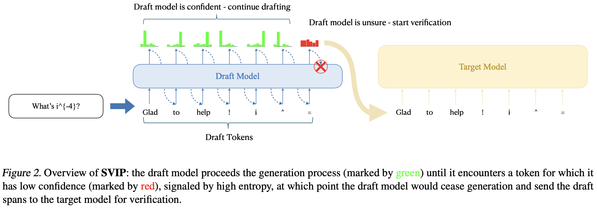</img>
    </p>

- "AdaEAGLE: Optimizing Speculative Decoding via Explicit Modeling of Adaptive Draft Structures" [2024-12] [[paper](https://arxiv.org/abs/2412.18910)]

  > In the EAGLE framework, train a 3-layer MLP on the penultimate prefix token's input embedding and last hidden states to predict next round's draft length.
  >
  > Experiments on: Vicuna-7B-v1.3 | MT-Bench, Alpaca, HumanEval, GSM8K, CNN/DM, Natural Questions

    <p align="center">
    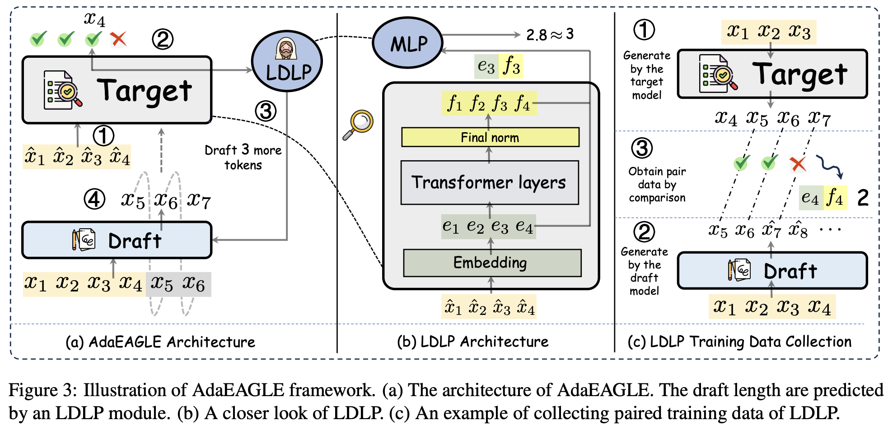</img>
    </p>

- "SpecServe: Efficient and SLO-Aware Large Language Model Serving with Adaptive Speculative Decoding" [2025-03] [[paper](https://arxiv.org/abs/2503.05096)]

  > 1. Adaptive drafter: incorporates efficiency estimation (based on historical data) into the drafting phase, achieving step-level speculative length control
  > 2. Confidence prior verifier: prioritizes the verification of tokens with high acceptance rates, achieving fine-grained request-level speculative length control
  > 3. SLO-aware Efficiency estimator: evaluates the efficiency of speculative decoding and achieves SLO (service level objective) awareness
  >
  > Experiments on: Vicuna-7B-v1.5, Vicuna-33B-v1.3, LLaMA-3.1-70B | MT-Bench, WMT14 De-En, CNN/DM, Natural Questions, GSM8K, DPR

- "Utility-Driven Speculative Decoding for Mixture-of-Experts" [2025-06] [[paper](https://arxiv.org/abs/2506.20675)]

  > Speculative decoding for MoEs. (MoEs break the key assumption in SD that the verification overhead compared to decoding a single token is negligible.)
  >
  > Experiments on: Mixtral, Phi-3.5, OLMoE, DeepSeek-V1, Qwen1.5 | GSM8K, HumanEval, MT-Bench

## Speculative Decoding + Other Technologies

- "Speculative Contrastive Decoding" [2023-11] [ACL 2024 Short] [[paper](https://arxiv.org/abs/2311.08981)]

  > Speculative decoding + contrastive decoding to achieve both decoding acceleration and quality improvement
  >
  > Experiments on: LLaMA-2-70B | WikiText, HumanEval, AlpacaEval, GSM8K

- "LayerSkip: Enabling Early Exit Inference and Self-Speculative Decoding" [2024-04] [ACL 2024] [[paper](https://arxiv.org/abs/2404.16710)]

  > - Apply layer dropout (higher dropout rates for later layers) and early exit loss during training
  > - At inference time, exit at early layers to generate draft tokens, and verify the draft tokens with the ramaining layers.
  > - Note: _this changes target model!_
  >
  > Experiments on: LLaMA-2-7B/13B, LLaMA-3-8B, LLaMA-3.2-1B

- "DEL: Context-Aware Dynamic Exit Layer for Efficient Self-Speculative Decoding" [2025-04] [[paper](https://arxiv.org/abs/2504.05598)]

  > DEL, a plug-and-play method that adaptively selects the exit layer and speculation length during inference on top of LayerSkip (2404.16710).
  >
  > Experiments on: LLaMA-2 7B/13B/70B, LLaMA-3.2 1B, CodeLLaMA 7B/34B | AQuA-RAT, CNN/DM, XSUM, HumanEval

    <p align="center">
    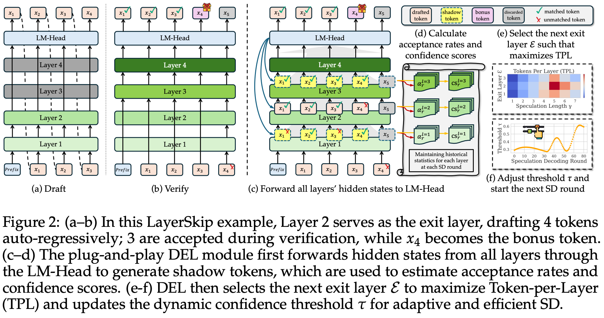</img>
    </p>

## Citation

If you refer to this repo, please cite the following paper:

```
@misc{zhang2024draftmodelknowsstop,
      title={Draft Model Knows When to Stop: A Self-Verification Length Policy for Speculative Decoding},
      author={Ziyin Zhang and Jiahao Xu and Tian Liang and Xingyu Chen and Zhiwei He and Rui Wang and Zhaopeng Tu},
      year={2024},
      eprint={2411.18462},
      archivePrefix={arXiv},
      primaryClass={cs.CL},
      url={https://arxiv.org/abs/2411.18462},
}
```

## Other Awesome Lists

[**Awesome-Code-LLM**](https://github.com/codefuse-ai/Awesome-Code-LLM), [**Awesome-Education-LLM**](https://github.com/Geralt-Targaryen/Awesome-Education-LLM)
