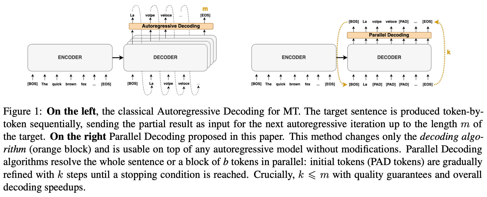

# Awesome-Speculative-Decoding

Reading list on speculative decoding.

**Table of Contents**

- [History & Origin](#history--origin)
- [Draft Models](#draft-models)
- [Retrieval-based Speculative Decoding](#retrieval-based-speculative-decoding)
- [Draft Tree Construction](#draft-tree-construction)
- [Verification Strategies](#verification-strategies)
- [Draft Length Control](#draft-length-control)
- [Speculative Decoding + Other Technologies](#speculative-decoding--other-technologies)
- [Citation](#citation)
- [Other Awesome Lists](#other-awesome-lists)

## History & Origin

- "Fast Inference from Transformers via Speculative Decoding" [2022-11] [ICML 2023] [[paper](https://arxiv.org/abs/2211.17192)]

  > Experiments on: T5-11B, LaMDA-137B | WMT En-De, CNN/DM

- "Accelerating Large Language Model Decoding with Speculative Sampling" [2023-02] [[paper](https://arxiv.org/abs/2302.01318)]

  > Experiemnts on: Chinchilla-70B | XSum, HumanEval

## Draft Models

- "Accelerating Transformer Inference for Translation via Parallel Decoding" [2023-05] [ACL 2023] [[paper](https://arxiv.org/abs/2305.10427)]

  > A block of [PAD] tokens are iteratively refined until no token changes in the block. Applies off-the-shelf to any autoregressive model.
  >
  > Experiments on: machine translation

    <p align="center">
    </img>
    </p>

- "Draft & Verify: Lossless Large Language Model Acceleration via Self-Speculative Decoding" [2023-09] [ACL 2024] [[paper](https://arxiv.org/abs/2309.08168)]

  > The target LLM selectively skips some of its intermediate layers to generate draft tokens
  >
  > Experiments on: LLaMA-2-13B/70B, LLaMA-2-13B-Chat, CodeLLaMA-13B | CNN/DM, XSum, HumanEval

- "Online Speculative Decoding" [2023-11] [ICML 2024] [[paper](https://arxiv.org/abs/2310.07177)]

  > Continuously update the draft model on observed user query data
  >
  > Experiments on: Vicuna-7B, Flan-T5-3B | Spider, GSM8K, CodeSearchNet-Python, Alpaca-finance

- "PaSS: Parallel Speculative Sampling" [2023-11] [[paper](https://arxiv.org/abs/2311.13581)]

  > Learn special tokens ($L$ lookahead embeddings $[LA]_1, \cdots, [LA]_L$) on a small training set
  >
  > Experiments on: LLaMA-7B | Wikipedia, Stack

- "Cascade Speculative Drafting for Even Faster LLM Inference" [2023-12] [NeurIPS 2024] [[paper](https://arxiv.org/abs/2312.11462)]

  > - Vertical cascade: in a series of draft models, each model reviews drafts from a smaller one, with the smallest model being a statistical model
  > - Horizontal cascade: assigns the largest draft model to generate the first draft token, and uses progressively smaller draft models to generate the following tokens (which are less likely to be accepted)
  >
  > Experiemnts on: Flan-T5, LLaMA-2-Chat-7B | GSM8K, MMLU

- "Medusa: Simple LLM Inference Acceleration Framework with Multiple Decoding Heads" [2024-01] [ICML 2024] [[paper](https://arxiv.org/abs/2401.10774)]

  > Train one head (a two-layer FFN with residual connection) for each draft token position
  >
  > Experiemnts on: Vicuna-7B/13B/33B, Zephyr-7B | MT-Bench

    <p align="center">
    </img>
    </p>

- "EAGLE: Speculative Sampling Requires Rethinking Feature Uncertainty" [2024-01] [ICML 2024] [[paper](https://arxiv.org/abs/2401.15077)]

  > The draft model autoregressively processes at the feature (hidden states before LM head) level and then derives tokens using the LM head of the target model
  >
  > Experiments on: Vicuna-7B/13B/33B, LLaMA2-Chat-7B/13B/70B, Mixtral-8x7B-Instruct | MT-Bench, HumanEval, GSM8K, Alpaca

    <p align="center">
    </img>
    </p>

- "GliDe with a CaPE: A Low-Hassle Method to Accelerate Speculative Decoding" [2024-02] [ICML 2024] [[paper](https://arxiv.org/abs/2402.02082)]

  > Each layer in the draft model attends to a corresponding layer in the target, counting from the top
  >
  > Experiments on: Vicuna-7B/13B/33B, Mistral-7B-Instruct-v0.1 | GSM8K, Finance-Alpaca, Spider, CodeSearchNet-Python

    <p align="center">
    </img>
    </p>

- "Hydra: Sequentially-Dependent Draft Heads for Medusa Decoding" [2024-02] [[paper](https://arxiv.org/abs/2402.05109)]

  > A variant of Medusa where each draft head takes output from the previous head as input
  >
  > Experiments on: Vicuna-7B/13B/33B | MT-Bench

    <p align="center">
    </img>
    </p>

- "Speculative Decoding via Early-exiting for Faster LLM Inference with Thompson Sampling Control Mechanism" [2024-06] [ACL 2024 Findings] [[paper](https://arxiv.org/abs/2406.03853)]

  > Introduces a trainable early-exiting layer on top of the target model's N-th layer hidden states to generate draft tokens
  >
  > Experiments on: LLaMA-2-13B/70B, LLaMA-2-Chat-70B, Vicuna-13B, CodeLLaMA-13B | GSM8K, XSum, HumanEval, MT-Bench

    <p align="center">
    </img>
    </p>

- "Training Domain Draft Models for Speculative Decoding: Best Practices and Insights" [2025-03] [[paper](https://arxiv.org/abs/2503.07807)]

  > domain-specific draft models (function calling, biology, Chinese)
  >
  > Experiments on: LLaMA-3.1-8B

- "Gumiho: A Hybrid Architecture to Prioritize Early Tokens in Speculative Decoding" [2025-03] [[paper](https://arxiv.org/abs/2503.10135)]

  > EAGLE for the first two draft tokens, Medusa for the next 5.
  >
  > Experiments on: Vicuna7B/13B, LLaMA-2-Chat-7B/13B/70B, LLaMA-3-Instruct-8B/70B | MT-Bench, HumanEval, GSM8K, Alpaca, CNN/DM, Natural Questions.

    <p align="center">
    </img>
    </p>

- "ML-SpecQD: Multi-Level Speculative Decoding with Quantized Drafts" [2025-03] [[paper](https://arxiv.org/abs/2503.13565)]

  > 4-bit quantization in MXFP4 datatype as draft model
  >
  > Experiments on: LLaMA2 7B, Qwen2.5-Coder 7B | HAGRID, MBPP

    <p align="center">
    </img>
    </p>

- "DEL: Context-Aware Dynamic Exit Layer for Efficient Self-Speculative Decoding" [2025-04] [[paper](https://arxiv.org/abs/2504.05598)]

  > DEL, a plug-and-play method that adaptively selects the exit layer and speculation length during inference.
  >
  > Experiments on: LLaMA-2 7B/13B/70B, LLaMA-3.2 1B, CodeLLaMA 7B/34B | AQuA-RAT, CNN/DM, XSUM, HumanEval

    <p align="center">
    </img>
    </p>

## Retrieval-based Speculative Decoding

- "Ouroboros: Generating Longer Drafts Phrase by Phrase for Faster Speculative Decoding" [2024-02] [EMNLP 2024] [[paper](https://arxiv.org/abs/2402.13720)]

  > Extends the last draft token to phrases. Does not require additional training.
  >
  > Experiments on: Yi-Base-34B, DeepSeek-Coder-Instruct-33B, CodeLLaMA-Instruct-34B, LLaMA-2-Chat-70B | HumanEval, MBPP, GSM8K, CNN/DM, WMT16

    <p align="center">
    </img>
    </p>

- "SuffixDecoding: A Model-Free Approach to Speeding Up Large Language Model Inference" [2024-11] [[paper](https://arxiv.org/abs/2411.04975)]

  > N-gram draft model that's built on-the-fly from a suffix tree
  >
  > Experiments on: LLaMA-3-70B-Instruct | WildChat, Magicoder, Spider, AgenticSQL

    <p align="center">
    </img>
    </p>

- "SAM Decoding: Speculative Decoding via Suffix Automaton" [2024-11] [[paper](https://arxiv.org/abs/2411.10666)]

  > Another n-gram draft model that's built on-the-fly from a suffix tree
  >
  > Experiments on: Vicuna-7B-v1.3 | MT-Bench, WMT14 De-En, CNN/DM, Natural Question, GSM8K, DPR

- "Speculative Decoding for Multi-Sample Inference" [2025-03] [[paper](https://arxiv.org/abs/2503.05330)]

  > SD method tailored for multi-sample reasoning scenarios, such as self-consistency and Best-of-N sampling.
  >
  > "for any partial sequence on the path $i$, we use its $k$-token suffix as a query to search for matching prefixes in other paths"
  >
  > Experiments on: Qwen2.5-7B-Instruct, LLaMA-3-8B-Instruct | GSM8K, MATH

## Draft Tree Construction

- "GliDe with a CaPE: A Low-Hassle Method to Accelerate Speculative Decoding" [2024-02] [ICML 2024] [[paper](https://arxiv.org/abs/2402.02082)]

  > Expand each draft token to top-$k$ candidates where $k$ is a piecewise linear function of the top-1 confidence score $p$, set to 7, 5, 3, 1 for $p$ in (0, 0.3], (0.3, 0.6], (0.6, 0.8], (0.8, 1] respectively.
  >
  > Experiments on: Vicuna-7B/13B/33B | MT-Bench

    <p align="center">
    </img>
    </p>

- "EAGLE-2: Faster Inference of Language Models with Dynamic Draft Trees" [2024-06] [EMNLP 2024] [[paper](https://arxiv.org/abs/2406.16858)]

  > In the draft tree, some shallow nodes that are not expanded may have higher values than the deeper expanded nodes. Thus, EAGLE-2 reranks all draft tokens and select the top $m$ tokens with the highest values.
  >
  > Experiments on: Vicuna-7B/13B, LLaMA2-Chat-7B/13B/70B, LLaMA3-Instruct-8B/70B | MT-Bench, HumanEval, GSM8K, CNN/DM, Natural Questions

    <p align="center">
    </img>
    </img>
    </p>

## Verification Strategies

- "SpecTr: Fast Speculative Decoding via Optimal Transport" [2023-10] [NeurIPS 2023] [[paper](https://arxiv.org/abs/2310.15141)]

  > Introduced OTM - Optimal Transport with Membership cost - and an approximation that's linear in vocabulary size and logarithmic in candidate set size to tackle draft selection when there are multiple drafts
  >
  > Experiments on: PALM-2-Bison | LM1B

- "TETRIS: Optimal Draft Token Selection for Batch Speculative Decoding" [2025-02] [[paper](https://arxiv.org/abs/2502.15197)]

  > Selects draft tokens for verification based on draft model's output probability
  >
  > Experiments on: Vicuna-33B-v1.3, LLaMA-3.1-70B/405B-Instruct | ShareGPT, Chatbot Arena, Domain Tough Questions

    <p align="center">
    </img>
    </p>

## Draft Length Control

- "Dynamic Speculation Lookahead Accelerates Speculative Decoding of Large Language Models" [2024-05] [[paper](https://arxiv.org/abs/2405.04304)]

  > After generating a draft token, an FFN decides whether or not to continue drafting (input of FFN: top-10 draft model confidence, draft model entropy, token position)
  >
  > Experiments on: Vicuna-13B-v1.3, Starcoder-15B | CNN/DM, Alpaca, HumanEval, MBPP

- "Dynamic Depth Decoding: Faster Speculative Decoding for LLMs" [2024-08] [[paper](https://arxiv.org/abs/2409.00142)]

  > In the EAGLE framework, use the sum of the probabilities of all the sequences in the beam as a heuristic for whether or not to continue draft generation
  >
  > Experiments on: Vicuna-7B/13B, LLaMA2-Chat-7B/13B | MT-Bench

- "Draft Model Knows When to Stop: A Self-Verification Length Policy for Speculative Decoding" [2024-11] [[paper](https://arxiv.org/abs/2411.18462)]

  > After generating a draft token, the model decides whether or not to continue draft based on draft model entropy.
  >
  > Applies off-the-shelf to any autoregressive speculative decoding system without training.
  >
  > Experiments on: Pythia-6.9B, Vicuna-7B/13B-v1.3, LLaMA-3-70B, Qwen2.5-14B/32B, QwQ | MT-Bench, HumanEval, GSM8K, Alpaca, CNN/DM, Natural Questions, MATH, GPQA, AIME

    <p align="center">
    </img>
    </p>

- "AdaEAGLE: Optimizing Speculative Decoding via Explicit Modeling of Adaptive Draft Structures" [2024-12] [[paper](https://arxiv.org/abs/2412.18910)]

  > In the EAGLE framework, train a 3-layer MLP on the penultimate prefix token's input embedding and last hidden states to predict next round's draft length.
  >
  > Experiments on: Vicuna-7B-v1.3 | MT-Bench, Alpaca, HumanEval, GSM8K, CNN/DM, Natural Questions

    <p align="center">
    </img>
    </p>

- "SpecServe: Efficient and SLO-Aware Large Language Model Serving with Adaptive Speculative Decoding" [2025-03] [[paper](https://arxiv.org/abs/2503.05096)]

  > 1. Adaptive drafter: incorporates efficiency estimation (based on historical data) into the drafting phase, achieving step-level speculative length control
  > 2. Confidence prior verifier: prioritizes the verification of tokens with high acceptance rates, achieving fine-grained request-level speculative length control
  > 3. SLO-aware Efficiency estimator: evaluates the efficiency of speculative decoding and achieves SLO (service level objective) awareness
  >
  > Experiments on: Vicuna-7B-v1.5, Vicuna-33B-v1.3, LLaMA-3.1-70B | MT-Bench, WMT14 De-En, CNN/DM, Natural Questions, GSM8K, DPR

## Speculative Decoding + Other Technologies

- "Speculative Contrastive Decoding" [2023-11] [ACL 2024 Short] [[paper](https://arxiv.org/abs/2311.08981)]

  > Speculative decoding + contrastive decoding to achieve both decoding acceleration and quality improvement
  >
  > Experiments on: LLaMA-2-70B | WikiText, HumanEval, AlpacaEval, GSM8K

- "LayerSkip: Enabling Early Exit Inference and Self-Speculative Decoding" [2024-04] [ACL 2024] [[paper](https://arxiv.org/abs/2404.16710)]

  > - Apply layer dropout (higher dropout rates for later layers) and early exit loss during training
  > - At inference time, exit at early layers to generate draft tokens, and verify the draft tokens with the ramaining layers.
  > - Note: _this changes target model!_
  >
  > Experiments on: LLaMA-2-7B/13B, LLaMA-3-8B, LLaMA-3.2-1B

## Citation

If you refer to this repo, please cite the following paper:

```
@misc{zhang2024draftmodelknowsstop,
      title={Draft Model Knows When to Stop: A Self-Verification Length Policy for Speculative Decoding},
      author={Ziyin Zhang and Jiahao Xu and Tian Liang and Xingyu Chen and Zhiwei He and Rui Wang and Zhaopeng Tu},
      year={2024},
      eprint={2411.18462},
      archivePrefix={arXiv},
      primaryClass={cs.CL},
      url={https://arxiv.org/abs/2411.18462},
}
```

## Other Awesome Lists

[**Awesome-Code-LLM**](https://github.com/codefuse-ai/Awesome-Code-LLM), [**Awesome-Education-LLM**](https://github.com/Geralt-Targaryen/Awesome-Education-LLM)
